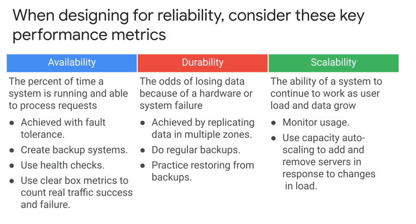

# Architect Design and Process

## Acronyms

* KPIs
  * KPI = Key Performance Indicators
  * KPIs need an accompanying goal (duh)
* Service Level schtuff
  * SLA = Service Level Agreements - legal agreement specifying system behaviour - more restrictive version of SLO 
  * SLI = Service Level Indicators - measurable metric that says whether we are achieving the SLO/SLA
  * SLO = Service Level Objectives

## Microservices 

### 12 factor app - best practises
1. Codebase
   * Git version control
2. Depedencies
   * Declared explicitly and stored in version control (`build.gradle`, `reqs.txt`, etc.)
3. Configuration
   * Environment specfic variables are kept separate from code
   * Deployment and application specific configurations are injected at run/deploy time 
     * Use templatized yamls/jsons, etc.
4. Backing service
   * DB/Cache - accessed using URLs
   * Ideally can swap out and replace by another one with limited code change
5. Build / Release / Run
6. Process (application processes)
   * State/Stateful
7. Port binding
   * Applications are self-container and expose a port and protocol externall
     * No external dependancy on tomcat server, etc.
8. Concurrency
   * Scale-out to be able
9. Disposability
   * Apps should be able to handle failure of underlying hardware
     * Graceful shutdown & Recover quickly
     * No corruption of state
10. Dev/Production parity
    * Same env state in Dev vs. Prod
11. Logs
12. Admin processes
    * One-off processes - separate from the usual app running
    * Should be automated - not manual

## Reliability of a system

1. Availability (HA)
2. Durability
3. Scalability

Service Recovery/retry:
* Exponential backoff pattern
* Circuit Breaker pattern:
  * Proxy ahead of service that monitors service health
  * If service is not healthy, traffic will not be forwarded to the service
* Lazy deletion
  * Data deletion processes

## Disaster recovery

### Compute Instance workloads

* Instance Groups are regional

### RPO vs. RTO

* RPO = Recovery Point Objective
* RTO = Recovery Time Objective