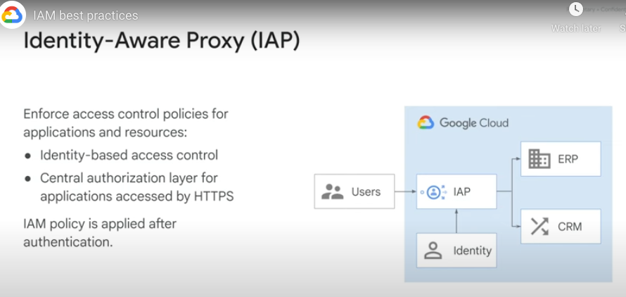

# IAM

## Organisational hierarchy
Organisation -> Folder -> Project -> Resource

## Organisation Restrictions

* Impacts users of company devices
* Restrictions put in places by:
  * GCP org/project admins
  * Egress admins
* Egress proxy admin configures proxy to add Org Restrictions headers to all HTTP requests coming from the managed device
* For users of company managed devices, they can only access authorized GCP orgs
* Meant to prevent data exfiltration

## IAP (Identity Aware Proxy)

## IAP with TCP Forwarding

Allows you to SSH/RDP to instances without needing a VPN

