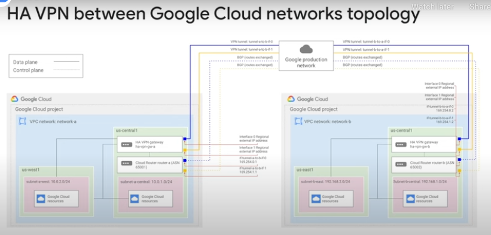

# Interconnecting networks

## Introduction to Cloud Interconnect & Peering service stack

GCP offering in the cloud interconnect & network peering space.

FYI - Layer 2 is Data Link layer (Ethernet protocol)
FYI - Layer 3 is Network Layer (IP, IPSec, ICMP protocols)

* Dedicated connections provide a direct connection between networks
* Shared connection is via a partner
* Cloud VPN is in addition to these services - only difference is that Cloud VPN traffic goes over the public internet

* All of these options allow for private IP connectivity between networks
* Where they differ is in:
  * Support capacity (in Mbps or Gbps)
  * Requirements for using the service
* Cloud VPN capacity notes:
  * 1.5Gbps is for when traffic is over public internet
  * 3Gbps is for when traffic is over peering link (between 2 VPN GWs on GCP i'm guessing)

## Cloud VPN
* 2 types of Cloud VPN:
  * HA VPN
    * IPSec VPN
  * Classic VPN
    * IPSec VPN
    * Dynamic routes (identified and stored in Cloud Router)
* Max MTU is 1460 bytes - more than this is not supported by Cloud VPN
* Cloud VPN supports both static and dynamnic routes
  * Cloud Router supports dynamic route discovery using BGP
* ~~Cloud VPN gateways are Regional resources with regional public IPs~~

## Cloud HA VPN topologies

1. 1 HA VPN GW to peer VPN devices (that are not HA VPNs)
   1. 1 HA VPN GW to 2 VPN devices each with 1 IP address
      1. Allows for redundancy at the on-premise side
   2. 1 HA VPN GW to 1 VPN device that uses 2 IP addresses
   3. 1 HA VPN GW to 1 VPN devices that uses 1 IP address
2. 1 HA VPN GW to other HA VPN gws
3. 1 HA VPN GW to AWS virtual private gw

Example of connecting 2 VPC networks together by using 2 HA VPN gws - 1 in each nw

More topologies here - https://cloud.google.com/network-connectivity/docs/vpn/concepts/topologies

## Dedicated interconnect

* **Provides direct physical connections** between GCP VPC and on-premise network
* In order to use Dedicated Interconnect, your on-premise network must physically meet Google’s network in a supported colocation facility
  * **If it doesn't you need to consider Partner Interconnect**

## Partner interconnect

* Provides direct connectivity your on-premise network and your GCP VPC via a partner network service provider

## Cross-Cloud interconnect

* Cross-Cloud Interconnect helps you to establish high-bandwidth dedicated connectivity between Google Cloud and another cloud service provider
  * Google currently supports Amazon Web Services, Microsoft Azure, Oracle Cloud Infrastructure, and Alibaba Cloud for use with Cross-Cloud Interconnect
* **Cross-Cloud Interconnect connections are available in two sizes: 10 Gbps or 100 Gbps**

