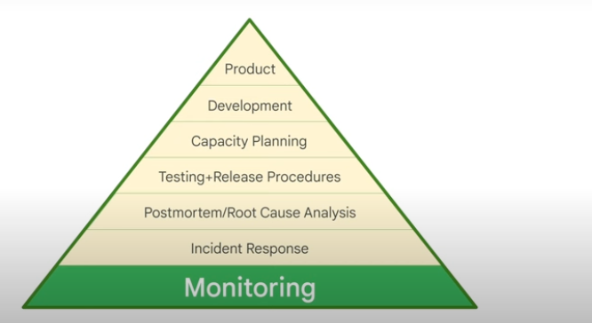
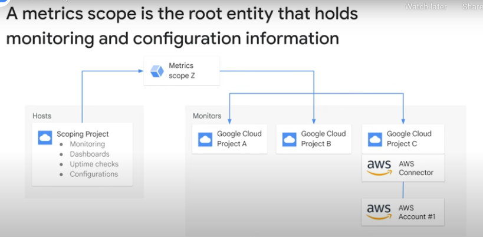

# Resource Monitoring and SRE

## Why monitoring?
Monitoring is at the base of the SRE pyramid 

## Cloud Monitoring (aka Monitoring) - formerly Stackdriver

* **Metrics Scope is the root Entity that holds**:
  * Dashboards, alerting policies, uptime checks, notification channels, group definitions, etc.
  * Monitoring/metrics data and logs from projects 
    * This monitoring data stays in the project being monitored
* **Metrics scops is the place you can monitor multiple projects and even AWS accounts**
* Role assigned to 1 principal (user, group, etc.) on 1 Metrics scope applies to all projects' data that is in that metric scope
* **Alerting best practises**:
  * Alert on symptoms not causes (for eg. failing SQL queries instead of database being down (which could be a cause))
  * Reduce noise - only alert on key errors that are actionable
  * Use multiple channels (sms, email, slack, etc.)
* Uptime check on:
  * Compute instance, App Engine app, Load balancer, App on instance, etc.
  * Uptime checks could be HTTP checks
* Ops Agent is the daemon that runs on Compute instances - provides telemetry data
* **Uptime checks are supported on**:
  * Uptime monitoring check on a custom URL
  * VM instance
  * App Engine app
  * K8s service
  * AWS EC2 and AWS LB
  * Cloud Run revision

## Cloud Logging