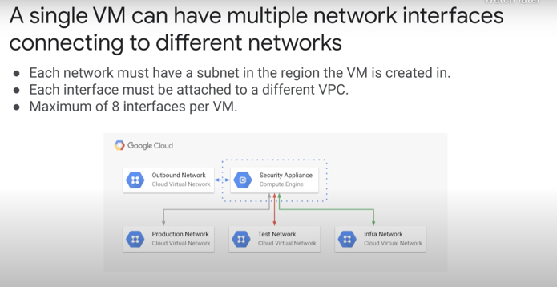

# Networking

## VPCs vs. Subnets

* VPCs are Global
* Subnets are Regional
* Subnets can be sized up by increasing the subnet ip range
  * No downtime for VMs in the subnet
* Subnets can't be down-sized - only up-sized
* Compute instances can have > 1 network interface
  * Minimum 1 network interface in a VPC
  * Upto 8 network interfaces in different VPC networks
  * The VPC networks MUST have a subnet in the same region as the Compute instance

Use case of 1 Compute instance in different VPC networks:

## VPC Redundancy

* You have global redundancy by setting up global VPC
  * Subnets in specific regions
    * Compute in multiple AZs within the Subnet

## Private Networking

### Private Google Access

* This is a setting in the Subnet when you create it
* When enabled:
  * VMs without public IPs can access the public IPs of public Google Apps, APIs and services
  * This isn't the same as using Cloud NAT

**TODO - How can private services access Google services/apis via non-public internet?**

**TODO - I.e. - what is the equivalent of Private Link?**

## Cloud VPN

2 types of VPN Gateways on GCP:
* HA VPN
* Classic VPN

High level series of tasks that need to be done to enable a virtual private network between
a GCP network and an AWS network:

1. Create the HA VPN gateway and Cloud Router on Google Cloud
2. Create an AWS Customer gateway and a Target gateway
3. Create a VPN connection with dynamic routing on AWS
4. Create an external VPN gateway and VPN tunnels on Google Cloud
5. Add BGP peers to the Cloud Router
6. Verify the configuration!

## Network Service Tiers
# TODO: READTHIS !!!

## VPC Service Controls
# TODO: READ THIS!!!