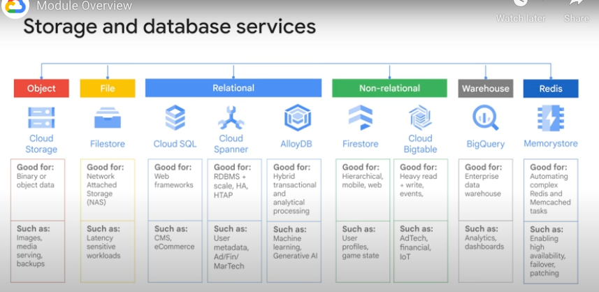

# Storage & Database services

## Contents

* Introduction
* Cloud Storage (object storage)
  * Storage Classes
  * Notes
  * Consistency
  * Data Import services - for TBs or PBs of data
  * Access data in another project's bucket
* Firestore (managed file system service - managed NAS)
* CloudSQL
* Cloud Spanner
* AlloyDB for PostgresSQL
* Firestore
* BigTable
* Memorystore for Redis

## Introduction

How to choose which storage service to use by use case.

## Cloud Storage

### Storage classses

**Durability** across ALL storage classes is 11 9's durability

### Notes

* Object storage - not a file system
* Directories are just another objects
* **Files cant be indexed** - like how they would in a file system
* Storage classes for Cloud Storage are:
  * Standard
  * Nearline
  * Coldline
  * Archive
* **Durability** across ALL storage classes is 11 9's durability
* Access is via
  * REST Json/Xml API
  * `gcloud storage`
* **Storage Classes of objects can be changed without moving** it from bucket to bucket - Lifecycle Management makes use of this as well
* **Buckets can never be changed from Regional to Multi-Regional and vice-versa**
* **Access Controls**:
  * IAM - bucket-level access controls
  * **ACLs** - fine-level access controls
    * **Max of 100 ACL 'entries' per bucket**
    * **Each ACL 'entry' contains:**
      * **Scope** - i.e. principal
        * `allUsers` means all users including those that are not Google users
        * `allAuthenticatedUsers` means all users that are authenticated
        * Principal could also be a user, group or service account
      * **Permission** action (read/write, etc.)
  * **Signed URLs** - provide a cryptographic key that provides time-limited access to a bucket or an object in the bucket
* Other Features that could be useful:
  * AutoClass
    * Feature that automatically transitions objects to appropriate storage classes
    * Based on patterns of object access
    * **When Autoclass is enabled, there will be no charges for**:
      * Early deletion
      * Transition between classes
  * Object change notifications via Pub/Sub
  * CSEK (customer supplied encryption key) - i.e. BYOK
    * Encrypted on client-side
    * Server-side encryption is also supported for CSEK - not sure exactly how and using what service (to host the key) though

### Consistency
* **UPLOADS ARE STRONGLY CONSISTENT** (as opposed to eventually consistent like in S3):
* You should NOT GET a HTTP 404 not found read error after:
  * write
  * metadata update
* **BUCKET Listing and Object Listing are also STRONGLY CONSISTENT**

### Data Import services - for TBs or PBs of data

* Transfer Appliance (hardware)
  * Hardware appliance that you rack in your data center, then capture - then send data to GCP
* Storage Transfer Service (software)
  * Import online data via this service - from S3, another bucket, web/rest - etc.
* Offline Media import (hardware)
  * Media (Tape, USB, etc) sent to a provider and then uploaded by the provider

### Access data in another project's bucket
* In source project, create a SA - add a Storage Account viewer privilege to the SA
* Generate the JSON key for the SA
* Share the JSON key to the other project -
  * `gcloud storage ls gs://<bucketname>/<prefix> --key-file credentials.json`

## Filestore

* Managed NAS (Network Attached Storage)
* Backend instances are either Compute Engine or GKE
* NFSv3 compliant
* Use cases:
  * Application migration to Cloud for apps that need filesystem
    * Wordpress hosting, for eg.
  * Media rendering - VMs that need shared FS

## CloudSQL

* HA across Zones within the Region
* CloudSQL can scale up
* Can scale out using Read Replicas
* Connect to CloudSQL recommendations:
  * Within GCP Project? - use private IP TLS
  * Outside GCP Project?:
    * Use public IP!
      * Cloud SQL Auth Proxy service - needs to be setup manually on a Compute instance
      * There's a .dmg installer to use to install and run the Auth Proxy as a daemon
    * Alternatively - could even peer VPCs and access via private IP!

## CloudSpanner

* Relational DB with data replication (i.e. sharding) for scale out
  * Replication across Zones in the Region
  * Can choose which region to place database in
* **Global service** - data is replicated globally across regions
* Schema and transactional (i.e. ACID) consistency
* A pattern that's documented on GCP is MySQL migration to CloudSpanner
* FS backed storage

## AlloyDB for PostgresSQL

* Postgres compatible relational DB

## Firestore

* Document NoSQL database
* Can run in following modes:
  * Datastore mode (for backwards compatibility with older Cloud Datastore product)
  * Native mode (for modern mobile/web apps)

**BIGTABLE scales UP well - FIRESTORE scales DOWN well!**

## BigTable
* HBase compatible APIs
* Distributed key-value database
* Tables are sparse
* BigTable tables are sharded into blocks of rows - called Tablets
  * Tablets are stored in FS in SSTable format
  * SSTable format provides an immutable map between keys and values
    * Keys and values are byte strings

## Memorystore for Redis
* Redis

